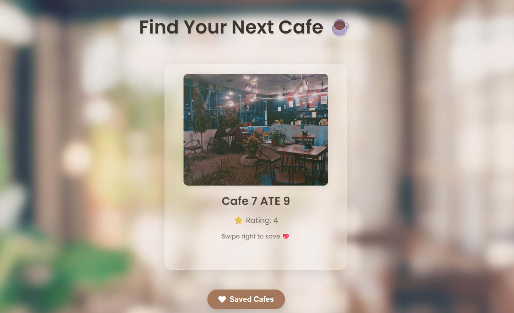

#  City Cafe List ☕️

Welcome to the **City Cafe List**! This is a simple web application designed to help you discover new cafes nearby. Using your device's location, the app fetches a list of local coffee shops that you can swipe through. Swipe right to save a cafe to your list of favorites, or swipe left to dismiss it.

---

## 📖 About the Project

This project was built to demonstrate the use of the **Google Maps Platform's Places API** to retrieve location data dynamically. It combines a modern frontend with a robust API to create a fun, interactive user experience.  

### ✨ Key Features
- **Geolocation**: Automatically detects your current location to find nearby cafes.  
- **Swipe Interface**: A mobile-friendly swiping gesture to navigate through cafe options.  
- **Data Persistence**: Uses `localStorage` to save your favorite cafes directly in your browser.  
- **Clean UI**: A liquid glass aesthetic provides a sleek and modern look.  

---

## 🛠 Tools and Technologies

- **HTML** → Provides the project's structure.  
- **CSS** → Styles the interface, including the "liquid glass" effect and animations.  
- **JavaScript** → Handles all the core logic, API calls, and user interactions.  
- **Google Maps Platform** → The **Places API** is used to fetch cafe data (names, photos, ratings).  
- **Hammer.js** → A lightweight JavaScript library used to recognize touch gestures for the swipe functionality.  

---

## ⚙️ How It's Built

The application works by calling the **Google Places API** with the user's latitude and longitude. The API returns a JSON object containing an array of nearby cafes. The JavaScript code then iterates through this array to dynamically create HTML elements (cards) for each cafe.  

These cards are styled with CSS and integrated with **Hammer.js** to enable the swiping gestures. Saved cafes are stored in `localStorage` and can be viewed later.

---

## 📸 Watch the demo

[](./Result_Shots/Vid.mp4)


---

## 🚀 How to Clone and Use

To get a local copy up and running, follow these simple steps:

1. **Clone the repository**  
    ```bash
   git clone https://github.com/aryan1524in/CityCafeList.git
    ```
2. **Navigate to the project directory**  
    ```bash
    cd CityCafeList
    ```
3. **Open the project**
Open the index.html file in your preferred web browser.
⚠️ Note: For geolocation to work correctly, it is recommended to run the project using a local server (e.g., VS Code's Live Server extension) to avoid browser security restrictions.

# How to Create a Google API Key

Follow the steps below to generate and secure your Google API Key for use with the Google Places API.

---

### 📌 Step 1: Go to the Google Cloud Console

Visit: [https://console.cloud.google.com/](https://console.cloud.google.com/)

---

### 📁 Step 2: Create a New Project

Use the **project picker** at the top of the page to create a new project, or select an existing one.

---

### 📚 Step 3: Enable the Places API (New)

1. In the left-hand menu, go to **APIs & Services** → **Library**.
2. Search for **Places API (New)**.
3. Click **Enable**.

---

### 🔑 Step 4: Create an API Key

1. Navigate to **APIs & Services** → **Credentials**.
2. Click **+ Create Credentials** → **API key**.
3. A key will be generated. Copy it.

---

### 🔒 Step 5: Secure Your API Key

1. Click the **Edit icon** next to your API key.
2. Under **Key restrictions**, select **HTTP referrers (web sites)**.
3. Add allowed referrers:
   - For local testing: `http://localhost:*`
   - For deployment: Your domain (e.g., `https://yourdomain.com/*`)

---

### 💻 Step 6: Add API Key to Your Script

In your `script.js`, replace the placeholder with your actual API key:

```javascript
const API_KEY = "YOUR_API_KEY_HERE";

